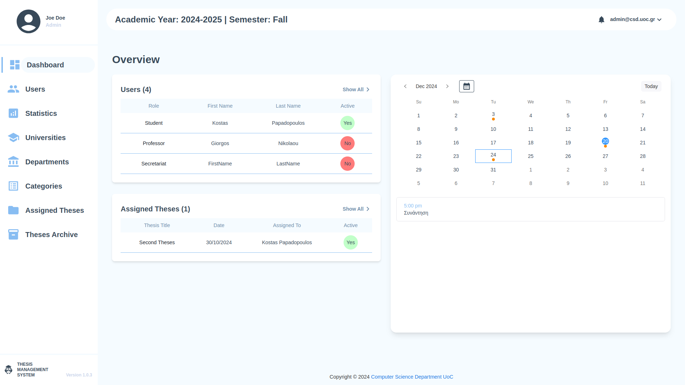
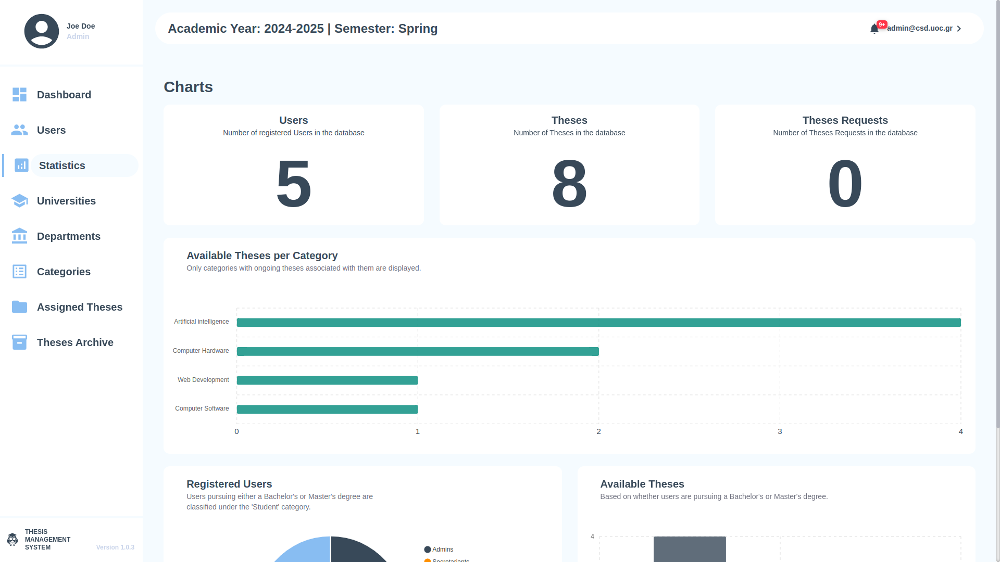
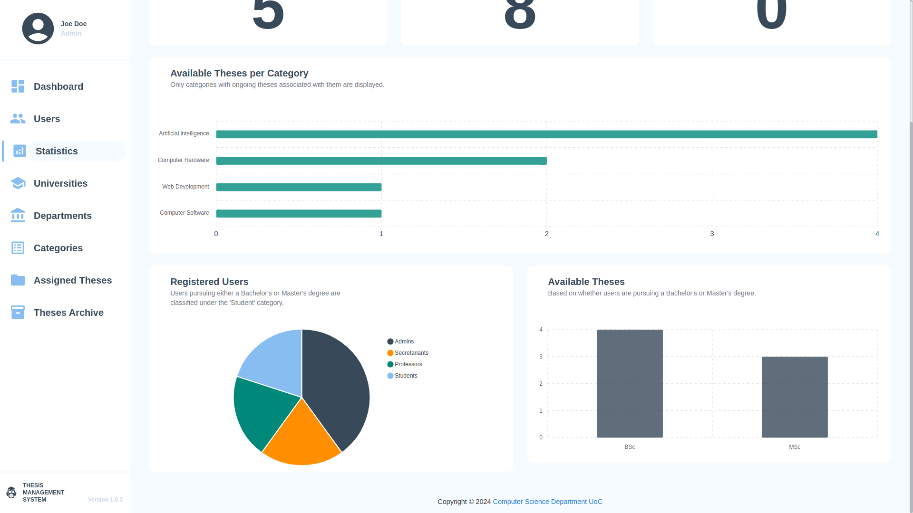

# Thesis Management System

#### Short Description

Expansion, modification, and virtualization (docker containers) of the existing web-based application Thesis Management System (TMS)
for the management of undergraduate, postgraduate, and doctoral theses in an Academic Institution, aiming to facilitate and support
professors and students in the announcement, assignment, monitoring, and completion of these works.

## Verbose Variant

What you will need:

- NodeJS
- React TS
- MongoDB

Tested on:

- NodeJS v20.8.1
- React TS
- MongoDB v4.4

## Docker Variant

What you will need:

- Docker

Tested on:

- Docker version 25.0.3, build 4debf41

### Before running

Create a `.env` file and set the variables as shown in the `.env.example` files

- Backend directory `.env` example

```
ACCESS_TOKEN_SECRET=string_example
REFRESH_TOKEN_SECRET=string_example
ENCRYPTION_KEY=string_example
SESSION_SECRET=string_example
SESSION_MAX_AGE=2678400000 # 31 days
AES_KEY=string_example
```

- Frontend directory `.env` example

```
VITE_REACT_APP_BUILD_TARGET=$TARGET
VITE_HOST=147.52.17.96 # set custom IP
DEBUG=*
```

### Useful commands

Inside _`integration`_ folder you can use the following commands:

> Run application (and build):

```sh
docker compose up --build
```

> Run application (with full logging available):

```sh
docker compose up
```

> Run application (detached mode/with no logging available):

```sh
docker compose up -d
```

> Stop application:

```sh
docker compose down
```

> View logs for specific project/container of the application (e.g., backend):

```sh
docker compose logs -f backend
```

> View running containers in the background

```sh
docker ps
```

### Functionality and Admin Capabilities

The Administrative Dashboard serves as the central command center for the institution, allowing for complete oversight of the academic lifecycle and system users.

#### User & Role Management

- Centralized Directory: View and manage all system participants, including Students, Professors, and Secretariat staff.

- Account Oversight: Monitor real-time "Active" status and manage user permissions to ensure secure access to department resources.

#### Academic Infrastructure
- Hierarchical Organization: Configure and maintain the foundational structures of the application, including Universities, Departments, and specific research Categories.

- Theses Lifecycle: Track the progress of research from inception to completion through the Assigned Theses tracker and the historical Theses Archive.



#### Operations & Scheduling
- Integrated Calendar: Manage academic deadlines and meetings (e.g., "Συνάντηση") directly from the dashboard to keep the department on schedule.

- System Statistics: Access data-driven insights regarding thesis distribution and departmental performance.




=== 


